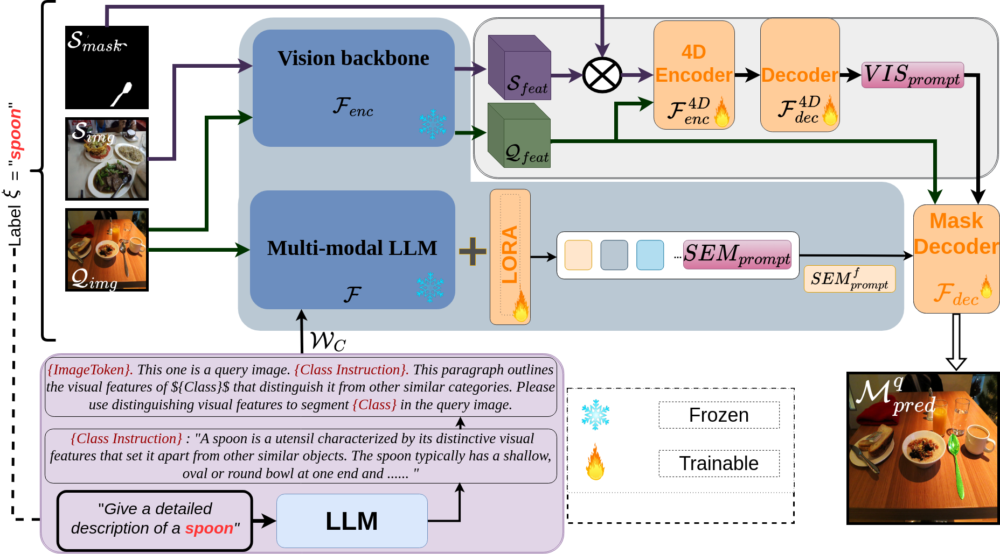

# DSV-LFS: Unifying LLM-Driven Semantic Cues with Visual Features for Robust Few-Shot Segmentation
<p align="center">  </p>

## Installation
```
Check requirements.txt file for packages
```

## &#x1F527;Get Started
** follow these steps to train and test DSV-LFS.**
### Dataset 
**1.** Download the dataset from the following links.
+ PASCAL-5<sup>i</sup>: [PASCAL VOC 2012](http://host.robots.ox.ac.uk/pascal/VOC/voc2012/) + [SBD](http://home.bharathh.info/pubs/codes/SBD/download.html)
+ COCO-20<sup>i</sup>: [MSCOCO2014](https://cocodataset.org/#download)

#### SAM ViT-H weights
Download SAM ViT-H pre-trained weights from the [link](https://dl.fbaipublicfiles.com/segment_anything/sam_vit_h_4b8939.pth).

#### llava-v1.5-7b
Download llava-v1.5-7b model from the [link](https://huggingface.co/liuhaotian/llava-v1.5-7b).


#### clip-vit-large-patch14-336 
Download clip-vit-large-patch14-336 model from the [link](https://huggingface.co/openai/clip-vit-large-patch14-336).

### Training
```
deepspeed  train.py \
  --version="PATH_TO_llava-v1.5-7b" \
  --dataset_dir='./dataset' \
  --vision_pretrained="PATH_TO_SAM" \
  --vision-tower="PATH to clip" \
  --benchmark= "pascal" or "coco" \
  --fold="0" \
  --exp_name="name"\
  --shot="1" \
```

## Citation 
If you find this project useful in your research, please consider citing:

```
@inproceedings{Karimi2025DSVLFS,
  title     = {DSV-LFS: Unifying LLM-Driven Semantic Cues with Visual Features for Robust Few-Shot Segmentation},
  author    = {Amin Karimi and Charalambos Poullis},
  booktitle = {Proceedings of the IEEE/CVF Conference on Computer Vision and Pattern Recognition (CVPR)},
  year      = {2025},
 
}

```

## Acknowledgement
-  This work is built upon the [LISA](https://github.com/dvlab-research/LISA) and [SAM](https://github.com/facebookresearch/segment-anything). 


